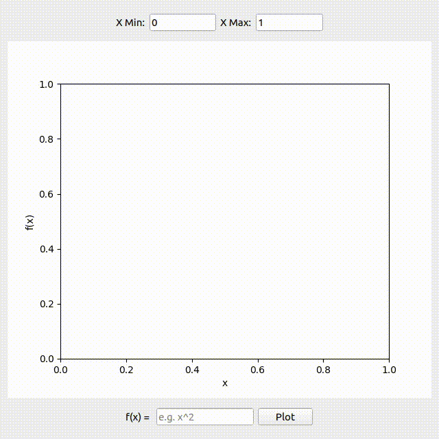
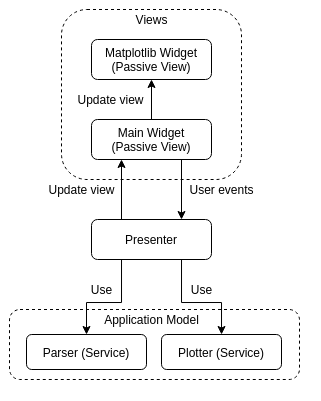

# Python Function Plotter
A desktop function plotting application written in Python and Qt (PySide2).

## Usage
- Type the function in the input field at the bottom.
- You can change the range of x values to plot from the input fields at the top.
- Click plot.

<div style="text-align: center;">

</div>

## Dependencies
The project uses Python 3.8.5.
All the python packages used are in [requirements.txt](requirements.txt).

Create and activate a virtual environment

```
python3 -m venv venv
source venv/bin/activate
```

Install the dependencies with pip

```
pip install -r requirements.txt
```

## Running the Tests
This project uses pytest and pytest-qt. After installing the dependencies, you
can run all the unit tests using

```
pytest -m unit
```

To run end-to-end tests, use

```
pytest -m e2e
```

## Architecture
I used an architecture similar to the Model-View-Presenter architecture with the
passive view as explained by Martin Fowler. The main difference is that the
application model is entirely composed of services.

<div style="text-align: center;">

</div>

- The model consists of:
  - A Parser service that validates the input expression and parses it to an
    expression tree
  - A Plotter service that takes x min and max values, validates them and
    calculates the y values using the given Expression Tree
- The view is a passive view and consists of:
  - The main widget
  - A plotting widget that uses Matplotlib
- The presenter:
  - Observes changes to the view
  - Invokes the Parser service to generate the expression tree
  - Invokes the Plotter service to plot the function based on the x min and max
    values
  - Updates the view to display the plot or error messages

## License
MIT License, check the [LICENSE file](LICENSE)